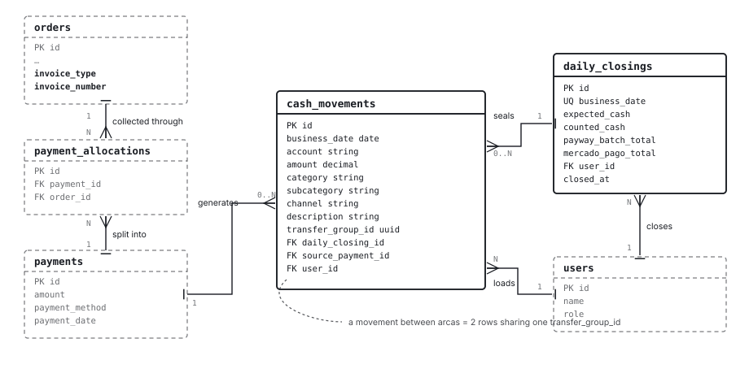

# Cash Module — V1 Design

**Status:** draft for review. Not a spec yet, not a plan yet.

**Sources:** the business-rules document `spec_modulo_caja_v1.md` (distilled
from seven months of real spreadsheets), plus a design session that resolved
the decisions that document left open and corrected a few it got wrong.

This file is the single place where the whole design lives: concepts, rules,
data model, flows and screens. Read it end to end; everything downstream (spec,
plan, code) should derive from here.

> UI labels appear in Spanish throughout, because they are the real interface
> text. Everything else — prose, identifiers, table and column names, enum
> keys, service names — is in English.

---

## 1. Purpose

Move the daily cash book out of monthly Excel workbooks and into the app,
keeping the physical rituals that already work and fixing the structural flaws
of the spreadsheet.

The unit of the system is the **money movement**, not the sale.

Success is measured by five things:

1. The cashier closes a day faster than with Excel, with no extra training.
2. Zero "adjustment" movements — every discrepancy is recorded with a date.
3. The month's numbers come out of the app with no manual arithmetic.
4. The balances per arca match the physical counts, week after week.
5. Internal transfers stop being counted as expenses.

---

## 2. What this design changes vs. the business document

The business document is the source for the rules. Where this design departs
from it, the departure is deliberate and listed here.

| # | The business doc says | This design does | Why |
|---|---|---|---|
| 1 | Five arcas; the drawer is part of "Efectivo" | **Six arcas**: the drawer (`Caja del día`) is separate from the bundles (`Caja grande`) | The daily count only works if the drawer is its own place. Three rules (day starts at zero, daily count, weekly count) stop needing special-cased code and become consequences of the model. |
| 2 | R-7: the drawer/arca distinction is "not a model distinction" | **It is a model distinction** | The expected-cash formula needs it. Without it, a bank deposit dated today makes today's expected drawer go negative. |
| 3 | R-6: the change fund has a fixed amount | Its balance is **derived**, like every other arca | The real spreadsheets show it drifting (81,600 → 81,800 → 101,800 across three days of August). The "fixed amount" is an operating habit, not a system value. |
| 4 | R-16/R-17: partner movements identify the partner; there is a partner account | **`partner` is only a category.** No partner field, no account screen | Owner decision: the need is to mark "I took money" and "I put it back", nothing more. |
| 5 | §8 lists a monthly P&L and a closing series | **Both cut from V1** | Owner decision: analytics come later. |
| 6 | §6.1 step 4 stores the closing's totals per channel | Stores only what is **not derivable** (plus `expected_cash`, see §6.3) | Sealed movements can be summed forever; a second copy can drift. |
| 7 | The category is called "Transferencia interna" | The UI calls it **"Movimiento entre arcas"** | "Transferencia" already means a collection channel in this business. Two meanings for one word confuse the operator on day one. |
| 8 | **Nothing** — the document never mentions the app's sales module, and assumes the cashier types every sale by hand into the cash book | **Every `Payment` generates its own `CashMovement`.** A collection made in the app appears in the day's cash book on its own, with nobody re-entering it | The app already records every collection with method, amount and date: it is the same data. Typing it twice is double work and guarantees the two modules end up saying different things about the same money. Full detail in §4.1. |

One correction in the other direction: the business document claims internal
transfers were recorded in the spreadsheet as plain expenses. They were not —
both legs exist (`Ingresos` and `Egresos` sheets, same date and same amount,
with an empty "Fondo Impactado" tag so they stay out of the expense totals).
The real problem is that they are **two independent rows in two different
sheets with nothing linking them**, which is what R-2 fixes.

---

## 3. Concepts

### 3.1 Arcas

Places where money lives. Six, fixed in V1. A balance is always the sum of that
arca's movements and is never edited by hand.

| Key | UI label | What it is | Currency |
|---|---|---|---|
| `drawer` | Caja del día | The till. Holds today's cash sales minus today's cash expenses. | ARS |
| `main_cash` | Caja grande | The accumulated bundles in custody. | ARS |
| `change_fund` | Remanente | The change fund. | ARS |
| `bank` | Banco | Bank account. | ARS |
| `mercado_pago` | Mercado Pago | Mercado Pago balance. | ARS |
| `usd` | USD | Physical dollars. | USD |

**Reporting groups.** The balance report reads at a coarser grain, matching the
existing `Caja Grande` sheet:

- **Efectivo** = `drawer` + `main_cash` + `change_fund`
- **Banco** = `bank`
- **Mercado Pago** = `mercado_pago`
- **USD** = `usd`

Movements between arcas within the same group (wrapping the bundle, topping up
the change fund) cancel out at group level and do not appear in the report.

**USD is never converted and never added to pesos**, anywhere. There is no
grand total that mixes currencies.

### 3.2 Categories

| Key | UI label | Notes |
|---|---|---|
| `sale` | Venta | Requires a channel |
| `suppliers` | Proveedores | Goods |
| `fixed_expense` | Gastos fijos | Requires a subcategory |
| `internal_transfer` | Movimiento entre arcas | Always two legs |
| `partner` | Socio | Money a partner takes out or puts back |
| `cash_discrepancy` | Diferencia de arqueo | Recorded, never adjusted |
| `opening_balance` | Saldo inicial | One-time load per arca at startup |

Fixed-expense subcategories: `rent`, `salaries`, `social_charges`, `taxes`,
`utilities`, `store_expenses`.

Loading always uses the fine subcategory. Reports show the group total with the
detail available underneath — summing is free, splitting later is archaeology.

### 3.3 Sale channels

The channel determines the destination arca.

| Key | UI label | Destination arca |
|---|---|---|
| `cash` | Efectivo | `drawer` |
| `card` | Tarjeta | `bank` |
| `qr` | QR | `bank` |
| `transfer` | Transferencia | `bank` |
| `mercado_pago` | Mercado Pago | `mercado_pago` |
| `usd` | USD | `usd` |
| `compensation` | Compensación | **none** |

Channels are closed options, never free text.

`compensation` is the supplier-offset case (R-14): a supplier we owe takes
merchandise from us and the amount is deducted from the debt. It counts as a
sale for billing, but no money enters any arca, so the movement carries no
arca. That supplier's debt is adjusted by hand in the invoices module. Cash
tells invoices, never the reverse — the only contact point between the two
modules. Around $4M across seven months, so not an edge case.

### 3.4 Amounts

- Everything is recorded **gross, VAT included**, exactly as charged at the
  counter.
- **No collection fees in V1.** A $100,000 card sale enters `bank` as $100,000.
  Payway and Mercado Pago deductions stay invisible, as they are today.
- Amounts are **signed**: positive is an inflow, negative an outflow. Balances
  are a `SUM`, mirroring `stock_movements.quantity`.

---

## 4. Where movements come from

Two sources, one table.

### 4.1 Automatic — from a collection

The app already records every collection as a `Payment` (one tender, one
method, one date). Its methods map one-to-one onto cash channels, so a
collection already carries everything a cash movement needs.

```
vendedor  → nota de pedido (Order, pending)
cashier   → collects in the app → Payment(s) → CashMovement(s)   ← automatic
cashier   → loads by hand whatever does not pass through there
```

The three services that create payments call the cash service explicitly,
inside their existing transaction:

- `Payments::CollectSaleNote` — the day's sale
- `Payments::CollectOnAccount` — an instalment on a payment-on-account sale
- `Payments::AllocatePayment` — a credit-account collection

**Explicit calls, not an `after_create` callback on `Payment`.** The project
already made this choice for stock ("no `StockMovement` callbacks; services do
it after writes") and the new module should not introduce the opposite
convention.

All three produce `sale` category movements: money arrived today. Only the
first is a sale *made* today; the other two collect older sales. That
distinction stays available structurally through `source_payment_id`, never
through the description text.

Because the services group tenders by method and create **one `Payment` per
method**, a sale split between cash and card produces two payments and
therefore two cash movements — one per arca. Which is exactly how the
spreadsheet records it today: one row per channel. The invariant stays clean:
**one `Payment` = one `CashMovement`.**

Default descriptions, frozen at creation:

| Origin | Default text |
|---|---|
| `CollectSaleNote` | empty (the ordinary counter sale) |
| `CollectOnAccount` | `Cobro a cuenta — Nota 3345 — Juan Pérez` |
| `AllocatePayment` | `Cobranza cta. cte. — Juan Pérez` |

Automatic rows are **read-only inside the cash module**: editing them would
make the two modules say different things about the same money.

### 4.2 The reverse path

Making the row read-only forces a path to undo it.

Today a `Payment` **cannot be modified**: the routes are only `new` and
`create`, and there is no collection-editing screen. The only thing that
affects it is cancelling the sale (`Sales::CancelOrder`), which destroys the
`payment_allocations` and leaves the `Payment` alive and orphaned — a
pre-existing limitation, already noted in `WORKING_CONTEXT.md`.

The rule, then:

- **Cancelling an already-collected sale reverses its cash movement.**
  `Sales::CancelOrder` calls `Cash::ReversePayment`, which creates a
  **reversing** movement: same amount with the opposite sign, same arca, same
  channel, a description stating what it reverses, and the same
  `source_payment_id` as the original — which is what links them. The original
  row is never edited or deleted.
- **It works the same whether the day is open or closed.** A reversing movement
  is always legal; editing the original stops being legal the moment the day is
  sealed (R-8). One rule, no branches, no exceptions to remember.
- If a collection-editing screen ever exists, it follows the same rule: reverse
  and re-record. A sealed movement is never touched.

On an open day this leaves two rows that cancel each other out instead of
making one disappear. That is deliberate: if money came in and went back out,
both things happened; and if it was a data-entry error, the day's count would
have caught it anyway.

**Dependency:** the orphaned `Payment` that `Sales::CancelOrder` leaves behind
today is a latent bug. With the cash module it becomes material, because the
movement makes it visible in the balances. Worth fixing in the same slice.

### 4.3 Manual

Everything that does not pass through a collection: day expenses, USD,
compensation, movements between arcas, partner movements, opening balances, and
any sale nobody loaded as a note.

---

## 5. Business rules

**R-1. Money never appears or disappears — it moves.** Every movement has an
identified origin or destination. The only exceptions are `opening_balance` and
`cash_discrepancy`.

**R-2. A movement between arcas is ONE operation that produces TWO rows.** Same
amount, opposite signs, category `internal_transfer`, sharing one
`transfer_group_id`. The user loads it once; the legs are born together in one
transaction and cannot desynchronise.

They are two rows rather than one so that any arca's balance stays
`SUM(amount) WHERE account = ?`, with no conditions. With a single row naming
origin and destination, every balance read would have to compensate for the
other side — in the balance report, in the daily count, in the filtered history
and in every future report. It is paid once on write instead of endlessly on
read.

**R-3. If a physical operation does not change any arca's total, it is not
recorded.** Breaking a large note into smaller ones, change taken from an old
bundle and replaced within the day — the internal organisation of physical cash
is not accounting.

**R-4. The drawer starts every day at zero,** because the previous close
emptied it into the bundles.

**R-5. Change given back is not a movement.** Taking $50,000 for a $30,000 sale
is one movement of $30,000.

**R-6. A cash expense is charged to the arca the money physically came from.**
Paid out of the till — the common case — it goes in the drawer zone, against
`drawer`. Paid out of a bundle because the till was empty, typically first thing
in the morning, it goes in the arca zone, against `main_cash`. The cashier knows
which, because she is the one who took the bill.

At closing time the drawer is emptied in two steps, in this order:

```
1. discrepancy = counted − expected, as a cash_discrepancy movement on drawer
2. a single signed transfer of the counted amount:
     counted > 0 → Caja del día → Caja grande     "the bundle was wrapped"
     counted = 0 → nothing to wrap, no transfer
```

After step 1 the drawer holds exactly what was counted; after step 2 it holds
zero. That is true whatever the numbers were, so there is one rule and no
branches, and the order of loading cannot change the result.

When the day's cash expenses exceed its cash sales the expected amount is
negative — the partial case, where the till had money but not enough and a
bundle made up the difference. Step 1 then records a positive discrepancy for
what the bundle put in, which is the honest statement: money entered the drawer
and no movement said so. R-11 applies, as it does to any other difference. The
screen presents it in the operator's words rather than as a negative number —
see §7.2.

**The count is defined by `account`, never by the zone.** Expected drawer =
`SUM(amount) WHERE account = 'drawer' AND business_date = D`. The zones are UI;
what feeds the count is the arca. A USD sale is loaded in the drawer zone but
its arca is `usd`, so it never enters the peso count.

**R-7. Deliberate treasury operations declare their arca.** Deposits, partner
withdrawals and movements between arcas name their origin explicitly and never
touch the drawer. R-6 is for the everyday flow where nobody thinks about arcas;
R-7 is for when the choice *is* the decision.

**R-8. Movements of a closed day are immutable.** Never edited, never deleted.
Errors are corrected with a new movement that explains what it corrects.

**R-9. A sale made after the close is recorded on the next day.** The day is
not reopened.

**R-10. There is no reopening, ever.** If a sale from an already-closed day
turns up, it is recorded today with a note stating which day it belonged to.
The accepted cost: that day's billing stays short forever. The benefit: nobody
can reopen a day "to make it balance".

**R-11. Discrepancies are recorded, never adjusted.** A count that differs
produces a `cash_discrepancy` movement for the exact difference, with date and
context. Any "sync adjustment" mechanism is forbidden.

**R-12. The day is verified once, at closing.** Expected drawer = the day's
cash inflows minus the day's cash outflows. If it differs, R-11 applies and the
amount to wrap is the amount counted.

**R-13. The cash arca is verified against the balance report.** The owner
filters a date range and compares the closing balance against the physical
pile. He chooses the cadence — weekly, fortnightly, monthly. The system imposes
none and offers no counting workflow. A difference is recorded as an ordinary
movement with category `cash_discrepancy`.

**R-14. Supplier offset.** See §3.3 `compensation`.

**R-15. A sale requires a channel.** No exceptions, no free text.

**R-16. Partner movements are a category.** Taking money out is an outflow with
category `partner`; putting it back is an inflow with the same category. They
affect the arca balance. There is no partner identity field and no partner
account.

When a partner pays business costs with money he took, **each payment carries
its real category** — salaries are `fixed_expense/salaries`, not `partner`.
Only what he keeps is `partner`. The rule is "record each thing as what it is":
one extra row, correct numbers everywhere. (The business document left this
open in §6.4 and additionally required the salary to be recorded *before* the
withdrawal — with the two cash arcas separated, both are outflows from
`main_cash` and the ordering requirement disappears.)

**R-17. Opening balance.** At startup, one `opening_balance` movement per arca
with the amount taken from the last Excel close. Single-use category, excluded
from any result calculation — it is the starting position, not money that came
in.

---

## 6. Data model

Two new tables, two new columns. **Every money movement is a row of
`cash_movements`** — no satellite tables.

### 6.1 ERD



*Solid stroke: new tables. Dashed stroke: tables that already exist. `PK`
primary key, `FK` foreign key, `UQ` unique index; the crow's foot marks the
"many" side of each relationship.*

| Relationship | Cardinality | What it means |
|---|---|---|
| `payments` → `cash_movements` | 1 : 0..N | Collecting generates a movement. If the collection is undone the reversal is added, which is why there can be more than one with the same `source_payment_id` (§4.2). |
| `daily_closings` → `cash_movements` | 1 : 0..N | The close seals the movements of its date. With `daily_closing_id` present, the row is no longer edited or deleted. |
| `cash_movements` ↔ `cash_movements` | 2 rows | The two legs of a movement between arcas. **Not an FK**: they share a `transfer_group_id`, so each is born in a single insert and neither needs a later update. |
| `users` → `cash_movements` | 1 : N | Who loaded each movement. |
| `users` → `daily_closings` | 1 : N | Who closed each day. |
| `orders` ↔ `payments` | N : M | Already existed, via `payment_allocations`. Cash does not touch it: it only reaches as far as `payments`. |

Cash hooks into the rest of the app through **one place only**:
`source_payment_id`. It knows nothing about orders, customers or products. If
the sales module changes, cash only notices when `payments` changes.

### 6.2 `cash_movements`

| Column | Type | Holds |
|---|---|---|
| `business_date` | `date`, not null, index | The day the movement belongs to. Always explicit, never an implicit `Date.current`. |
| `account` | `string`, index | One of the six arca keys. **Null only for `compensation`**, which touches no arca. |
| `amount` | `decimal(10,2)`, not null | Signed: positive in, negative out. Never zero. |
| `category` | `string`, not null, index | One of the seven category keys. |
| `subcategory` | `string` | Required when `category = fixed_expense`. |
| `channel` | `string` | Required if and only if `category = sale`. |
| `description` | `string` | Text frozen at creation. Never recomputed on read. |
| `transfer_group_id` | `uuid`, index | Shared by the two legs of a movement between arcas. Null everywhere else. |
| `daily_closing_id` | `bigint`, fk → `daily_closings` | If present, the row is immutable. |
| `source_payment_id` | `bigint`, fk → `payments` | Present when the row was born from a collection. |
| `user_id` | `bigint`, fk → `users`, not null | Who loaded it. |

Validations:

- `account` required unless `channel = compensation`
- `channel` required if and only if `category = sale`
- `subcategory` required if and only if `category = fixed_expense`
- `amount` non-zero
- **Immutability guard** in the model (`before_update` / `before_destroy`
  raising when `daily_closing_id` is present). No database trigger — the
  project has none, and this is cheap and testable.

**`account`, `category`, `subcategory` and `channel` are `string` in the
database and `enum` in the model.** That is the convention the project already
uses everywhere: `users.role`, `orders.status` and `orders.order_type` are
`string` columns with a string-backed `enum` in the model. Postgres native
enums are ruled out (adding a value requires `ALTER TYPE` and breaks the
convention), as are integer-backed enums (unreadable in raw SQL).

Currency is derived from `account` (`usd` is the only non-peso arca); it is not
a column.

`decimal(10,2)` matches every other money column in the schema. The ceiling is
per row (99,999,999.99); the largest single movement observed is ~5.5M.

### 6.3 `daily_closings`

| Column | Type | Holds |
|---|---|---|
| `business_date` | `date`, not null, unique index | One close per day. |
| `expected_cash` | `decimal(10,2)`, not null | What the app said at closing time. |
| `counted_cash` | `decimal(10,2)`, not null | What the cashier counted. |
| `payway_batch_total` | `decimal(10,2)`, **nullable** | Null means *not verified* — not zero. |
| `mercado_pago_total` | `decimal(10,2)`, **nullable** | Same. |
| `user_id` | `bigint`, fk → `users`, not null | Who closed. |
| `closed_at` | `datetime`, not null | When it was sealed. |

The difference, the wrapped amount and the per-channel totals are **not
stored**: they derive from the sealed movements, which can no longer change.

`expected_cash` is the one exception, and it is deliberate: the close generates
its own movements (the discrepancy and the transfer to `main_cash`), so
deriving the expected amount would require excluding exactly those two — a
fragile rule that breaks the day someone loads a movement between arcas against
the drawer. One column removes the ambiguity permanently.

Nullable verification columns matter for the same reason: in six months the
question is "on how many days did the Payway batch differ from what we
recorded?". If unverified days stored zero, they would read as perfect days
nobody actually checked.

### 6.4 Added to `orders`

| Column | Type | Holds |
|---|---|---|
| `invoice_type` | `string`, **nullable** | `a` · `b` · `none`. Null while nobody has assigned it. |
| `invoice_number` | `string` | Present when `invoice_type` is `a` or `b`. |

**Four states, not three.** `none` means "it was decided this carries no
invoice" — the `Uno` of the spreadsheet. `NULL` means "nobody has said yet". If
`none` were the default, every sale would be born declaring it carries no
invoice and there would be no way to know which ones nobody looked at. Same
criterion as the closing's verification columns: empty is not zero.

The vendor creates the note **with no invoice type**: at that moment he does not
know whether it will be A, B or none. The cashier assigns it when collecting and
issuing the invoice, on the collection screen.

These replace two spreadsheet columns at once: "Tipo de factura" and "Tipo de
venta" (whose only observed value, `Uno`, means "no invoice").

They live on `orders` rather than `cash_movements` because they are the fiscal
identity of the **sale**: one invoice per sale, even when it is collected across
two channels or in several instalments.

### 6.5 Services

| Service | Does |
|---|---|
| `Cash::RecordMovement` | One row. The manual load from the day view. |
| `Cash::RecordTransfer` | Two rows with the same `transfer_group_id`, in one transaction. |
| `Cash::CloseDay` | Records the discrepancy if any, emits the signed transfer between drawer and bundles, seals every movement of the date with `daily_closing_id`, and persists the closing. |
| `Cash::RecordSaleFromPayment` | Called explicitly from the three collection services, inside their transactions. |
| `Cash::ReversePayment` | Creates the reversing movement of an undone collection. Called from `Sales::CancelOrder`. Never edits or deletes the original (§4.2). |

All return a `Result`, per the project pattern.

Reports are query objects, not services: `Cash::Reports::BalanceQuery` (§8.3)
and the filtered movement list (§8.4).

### 6.6 Timezone

`config.time_zone = "America/Argentina/Buenos_Aires"` must be set. The app
currently runs in UTC with no zone configured, which already caused off-by-one
bugs elsewhere. In this module the day boundary *is* the model: a movement
loaded at 21:30 local time would otherwise land on the next day.

`business_date` is additionally always an explicit value inherited from the day
being edited, never an implicit `Date.current`.

---

## 7. Flows

### 7.1 Loading the day

Two zones. What separates them **is not frequency or amount: it is the count.**
Whatever passes through the drawer is counted at night; everything else is not.

**The drawer zone** — ten to twenty rows a day. Sales and counter expenses.
**Nobody picks an arca**: sales route by channel, expenses come out of the
drawer. It is the only zone that feeds the count.

**The arca zone** — everything that does not pass through the drawer: paying a
supplier from the bank, paying a utility bill from Mercado Pago, a deposit, a
partner withdrawal. **Here the arca is declared**, because there is no default.

This zone **is also a daily one, and the cashier loads it too**. It is the
spreadsheet's `Egresos` sheet: 414 outflows across seven months, about 59 a
month, two or three per business day. On 03/08 there are nine — five supplier
payments from the bank and four from Mercado Pago. So loading has to be as fast
as the drawer zone: **a live row here too**, plus an arca column.

Two categories are out of the cashier's reach and **appear only for admin**:
`partner` (partners load their own movements) and `opening_balance` (one-time
startup load). It is not friction, it is permission: they simply are not in her
selector.

Both zones live on the same day screen, one below the other. No navigation:
open the 12th and you see everything that happened on the 12th.

Nothing prevents the same expense from being loaded in both zones. The design
does not fix that; the zones only make it obvious which is which.

### 7.2 Closing the day

Four steps, in one modal.

1. **Completeness.** The app shows how many records the day has and warns about
   today's uncollected sale notes (the same query that already feeds the
   sidebar badge, scoped by date). It informs; it does not validate — the paper
   pad is also used for quotes.

   The same block warns if there are **sales of the day with no invoice type
   assigned**. It does not block either: if the invoice has not been issued
   yet, the only effect of a block would be somebody entering an arbitrary
   value in order to close. The close seals `cash_movements`, not `orders`, so
   the invoice type can be filled in the next day without violating R-8 or
   reopening anything.
2. **Drawer count.** The app shows the expected amount. The cashier counts and
   **types what she counted** — always, whether it matches or not. There is no
   "it matches" button: a button gets pressed without counting.
3. **Digital verification.** Two optional numbers from outside: the Payway
   terminal batch total and the day's total in the Mercado Pago app. The app
   shows what it has recorded next to each and flags the differences. It
   informs; it never blocks. QR and transfers also land in `bank` and are not
   verified in V1.
4. **Close.** Records the discrepancy if the count differs, emits the transfer
   of the counted amount from the drawer to the bundles, seals every movement of
   the date, and persists the closing record — in that order, so the transfer
   and the discrepancy are sealed too. See R-6 for the arithmetic.

If the count differs, the discrepancy movement is created automatically and the
close proceeds. **The note field is optional on purpose:** requiring a
justification for a shortfall nobody can explain pushes the operator to change
the counted number until it balances, which destroys the very data the rule
exists to preserve.

When the day's cash expenses exceed its cash sales, the expected amount is
negative. The screen has to say *"El cajón no alcanzó: los fajos pusieron
$300.000. A envolver: $0."* rather than show a negative number.

### 7.3 Movements between arcas

A dedicated form — not the live row (§8.1): origin, destination, amount,
description. It previews the two rows before writing them, and
`Cash::RecordTransfer` creates both in one transaction sharing a
`transfer_group_id`. In the day table they then appear as two visually paired
rows, so each row stays one arca and one direction and the table remains
one-to-one with the model.

Known recurring cases: Mercado Pago → Banco (to pay suppliers), Caja grande →
Banco (deposits), Caja grande → Remanente (topping up change).

### 7.4 Startup

One `opening_balance` movement per arca, taken from the last Excel close. Month
one runs in parallel with the spreadsheet; from month two the app is
authoritative and the spreadsheet is a read-only backup. History is not
migrated in V1.

---

## 8. Screens

Four. All under `Web::Cash`, routes prefixed with `/web/cash/`.

### 8.1 Vista Día

The everyday screen. The only one the cashier uses daily, and the one that has
to beat Excel on speed.

- **Live row at the foot of the table.** Enter saves it, a new empty one
  appears below, focus returns to the first field. It is the Excel gesture; a
  modal per row is slower than the spreadsheet and loses success criterion #1.
- Columns: origin marker · description · paper number · invoice · channel ·
  inflow · outflow.
- Rows born from collections are mixed in, in load order, with a discreet
  origin marker — the cashier needs to know what she does **not** have to load.
- Right panel titled **"Ventas por canal"** — it groups by sale channel
  (Efectivo, Tarjeta, QR, Mercado Pago), not by arca — plus the **amount to
  wrap** (the drawer's net). No accumulated balances: the cashier does not see
  those. The title matters: the balance report groups by arca and shares some
  words with the channels; without the explicit label, "Efectivo" means
  different things on two screens.
- **The arca zone sits below, also with a live row**, plus an `Arca` column.
  It is daily loading, not exceptional (§7.1): that one column covers Cromosol,
  Metrogas, Telecom and the ~54 single-arca movements a month. Enter saves and
  opens the next, same as above.
- **Movements between arcas do not go through the live row.** They need two
  arcas and the live row has one column; a second column would sit empty 92% of
  the time, and "origin/destination" means nothing when paying a utility bill. A
  **"+ Movimiento entre arcas"** button opens a short form below the table:
  Desde · Hacia · Monto · Descripción. No category field (it is implied) and no
  sign (the direction determines it). Around 5 a month.
- The form **previews the two rows it will write** before saving. It is the only
  gesture in the app where one action produces two records, so it should not be
  a surprise.
- Once saved they are shown as **two paired rows**, one per arca, with a visual
  link marker. The table stays a mirror of the database and needs no grouping
  before rendering.
- The cashier navigates the whole month. Closed days are **read-only**: the
  restriction is on writing, not on visibility.
- **One deliberate exception:** on a closed day the invoice type and number
  remain editable. They are sale data, not cash data — the close freezes
  `cash_movements`, not `orders`. It is the only thing that can be touched on a
  sealed day, and it is worth writing down before it shows up as a surprise
  during implementation.
- Reuses `currency-input` (AR format).
- **Turbo Streams arrive with this screen.** The project has `turbo-rails`
  installed and Turbo Drive active, but not a single `format.turbo_stream` or
  `.turbo_stream.haml` anywhere — every form today submits in full and
  redirects. The live row is where the pattern is introduced, so it is new work,
  not reuse, and whatever shape it takes here is the shape the arca zone, the
  close and the transfer form will copy. Stimulus keeps doing what it already
  does on the screen: the amount format, the Enter key and the focus.

### 8.2 Cierre del día

A modal over the day view, not a separate screen. Three blocks matching steps 1
to 3 of §7.2, and a footer with the amount to wrap and the button. Three
typeable fields in the whole screen; only one is required.

### 8.3 Balance general

The replacement for the `Caja Grande` sheet. Pure report — no actions.

- Date range with presets: week · fortnight · month · custom.
- One row per **reporting group** (Efectivo, Banco, Mercado Pago, USD).
- Columns: opening balance · sales · suppliers · fixed expenses · partner ·
  between arcas · discrepancies · closing balance. **Every row reconciles
  arithmetically**; a row that does not is a bug, not something to audit by
  hand.
- Columns are named after the categories, never "income/expense" — a deposit is
  money changing place, not an expense.
- Fixed expenses expands to a breakdown by subcategory and arca.
- No grand total: USD stands alone, in dollars.
- Admin only.

### 8.4 Historial de movimientos

The drill-down of the balance report: when a number looks odd, this is where
the rows behind it are.

- Filters: arca · category · period · description search. Same mechanics as
  `orders#index` and `invoices#index` — `filter_form_controller` plus pagy.
- The arca filter offers the four reporting groups; the column shows the fine
  arca. Filter coarse, read fine, and the totals still match §8.3.
- Rows of category `internal_transfer` state their counterpart ("hacia Banco",
  "desde Caja del día"). Filtered to one arca you only see one leg, and without
  that the large rows look like money that evaporated.
- Read-only, always. Editing happens on the open day and nowhere else.
- Admin only.

### 8.5 Visual language

Follows `docs/UI_DESIGN_SPEC.md`: slate base, sober, no saturated accents as
decoration. Semantic colour only where it means something (a discrepancy, a
warning). UI labels in Spanish; HAML only.

---

## 9. Roles

**As shipped today the module is admin-only.** The three cash screens — the day
view, the balance report and the movement history — are the `admin`'s alone.

| Role | Can |
|---|---|
| `caja` | Nothing, for now. No day view, no closing flow, no reports. |
| `admin` | Everything: both zones of any open day, the closing flow, the whole month of day views, and the two reports. |

### The cashier's access is deferred, not cancelled

The module was designed around the cashier as its primary user and she is
expected back. The intended end state is:

| Role | Will be able to |
|---|---|
| `caja` | Load movements in **both zones** of any open day, run the closing flow, view the whole month of day views. **Cannot** load `partner` or `opening_balance` categories. **Does not see** the balance report or the movement history. |
| `admin` | Everything, plus the reports. |

The role logic that distinguishes the two is still in place and still tested:
`CashMovementPolicy::ADMIN_ARCA_CATEGORIES`, `#categories_for` and
`#forbidden_category?`. Re-opening the module to her is
`CashMovementPolicy#index?`, `CashMovementPolicy::Scope#resolve` and
`DailyClosingPolicy#create?` — three lines, no other change.

Pundit policies: `CashMovementPolicy`, `DailyClosingPolicy`. The restriction on
the cashier is on data as well as actions — the policy scope has to be real,
not decorative.

---

## 10. Out of scope for V1

Explicitly, and each for a reason:

- **P&L / monthly result report** — cut by the owner; analytics come later.
- **Partner account** (balance per partner) — cut; `partner` is only a
  category.
- **Closing series** (billing per day and channel over time) — cut.
- **A counting workflow.** Verification is the owner reading the balance report
  against the physical pile, at whatever cadence he chooses.
- Bundles/packages as a system entity — they are physical organisation.
- Integration with the Mercado Pago, Payway or bank APIs. (V2 note: MP credits
  net and with a lag, so reconciliation must compare the day's sales against
  gross API movements, not against credits.)
- Card and MP fees as records.
- Customer current accounts.
- Partial payment of supplier invoices (`paid_amount`).
- Goods receipt with line items.
- A recorded second approval of the close — the ritual stays physical.

---

## 11. Open items

None for now. The three that existed are closed:

- **Movements between arcas in the day table** → two paired rows (§8.1).
- **"Efectivo" carrying two meanings** → a labelling problem, not a grouping
  one: the day panel groups by channel and the balance report by arca. Solved
  by titling the panel "Ventas por canal" (§8.1).
- **Whether the cashier loads in the arca zone** → yes, every day. That zone is
  the spreadsheet's `Egresos` sheet (§7.1).

---

## 12. Constraints for implementation

Binding. Any downstream plan must copy these into its own constraints —
subagents do not see them otherwise.

- **Reuse before building.** `currency-input`, `filter_form_controller`, pagy,
  the `Result` pattern, `Payment::PAYMENT_METHOD_LABELS`, the index-filter
  pattern from `orders#index`. Look for the existing pattern before writing a
  new one. Two things this module needs have no precedent in the codebase and
  must be treated as new: saving a row without a full reload (see §8.1) and a
  form row inside a table.
- **Services return `Result`; controllers stay thin.** Direct ActiveRecord is
  acceptable only in trivial single-model actions.
- **HAML only.** No ERB, no queries or business logic in views.
- **Comments in code are in English, and minimal** — only where genuinely
  needed. Code and specs never cite `AGENTS.md` or project doctrine; a file
  explains itself.
- **UI text in Spanish** (labels, flashes, buttons). Code, comments and commit
  messages stay in English.
- **UI follows `docs/UI_DESIGN_SPEC.md`**: slate base, sober, no saturated
  accent as decoration.
- **The UI shows the operator's mental model**, not the internal persistence or
  calculation detail.
- **Dates and times use `Date.current` / `Time.current`**, never `Date.today` /
  `Time.now`.
- **Stock is never mutated directly** — irrelevant here, but the rule stands.
- **Commits:** English, `type(scope): title`, scope constant from the branch
  name, body in bullets, one logical change per commit, no attribution lines.
  The agent never runs `git commit`.

### Testing

This module introduces five new **write-money** flows —
`Cash::RecordMovement`, `Cash::RecordTransfer`, `Cash::CloseDay`,
`Cash::RecordSaleFromPayment` and `Cash::ReversePayment`. Per the project's
testing contract each needs a request spec including a hostile-input case (AR
format `1.500.000,50`, negative, non-numeric, blank), and each must be added to
the catalog in `docs/TESTING_GUIDE.md`.

**Read-money** additions: the balance query and the per-arca balance
derivation — unit or request specs with seeded data.

System specs only where correctness depends on Stimulus: the live row's
save-and-advance, and the live difference calculation in the closing modal.

---

## 13. Suggested build order

Each slice is useful on its own.

1. **Model, opening balances, Vista Día, movement loading and the daily
   close.** The daily spreadsheet dies here.
2. **Movements between arcas, arca-zone loading, partner movements.** The
   `Egresos` and `Ingresos` sheets die here.
3. **Balance report and movement history.** The `Caja Grande` sheet dies here.
4. **Compensation**, together with whatever the invoices module needs — the
   only contact point between the two, worth isolating.
